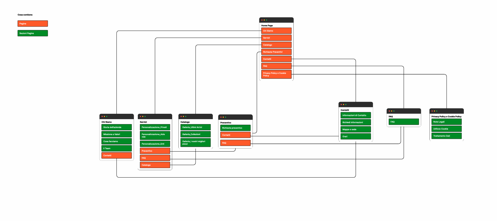
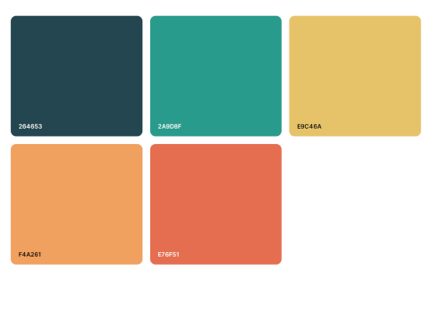

# Mint_Fashion

## Soluzioni Tecniche
Il sito è sviluppato interamente con tecnologie web standard lato client, senza dipendenze
da framework o CMS esterni. Le tecnologie impiegate sono:  
– HTML5 — struttura delle pagine  
– CSS3 — stile e layout responsivo  
– JavaScript (ES6+) — interattività e logica dinamica  
– JSON — gestione dei contenuti dinamici (prodotti e FAQ).  

Il deploy avviene tramite GitHub Pages, che pubblica automaticamente il contenuto del
repository al push sul branch principale. Non è richiesto alcun server back-end.  

## Architettura dei File
La struttura del progetto è organizzata come segue:  
Mint_Fashion/  
├── index.html ← Home page  
├── chi-siamo.html  
├── servizi.html  
├── catalogo.html   
├── richiesta-preventivi.html  
├── contatti.html  
├── faq.html  
├── privacy-cookie.html  
├── style.css ← Foglio di stile globale  
├── script.js ← Script JavaScript globale  
├── prodotti.json ← Dati prodotti (catalogo)  
├── faq.json ← Dati FAQ  
└── Immagini/  
 ├── prodotti/ ← Immagini dei prodotti  
 └── ... ← Altre immagini del sito  

## Sitemap
Le pagine che compongono il sito sono le seguenti:  
– Home page (/index.html)  
– Chi siamo (/chi-siamo.html)  
– Servizi (/servizi.html)  
– Catalogo (/catalogo.html)  
– Richiesta Preventivi (/richiesta-preventivi.html)  
– Contatti (/contatti.html)  
– FAQ (/faq.html)  
– Privacy Policy e Cookie Policy (/privacy-cookie.html)  
  

##Palette di Colori  
  

Documentazione tecnica completa: [Documentazione tecnica](https://github.com/marco-vela08/Mint_Fashion/blob/main/documents/Guida_Tecnica_Mint_Fashion.pdf)